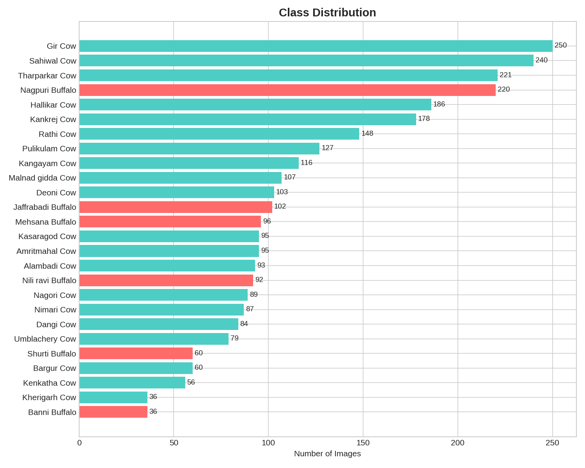
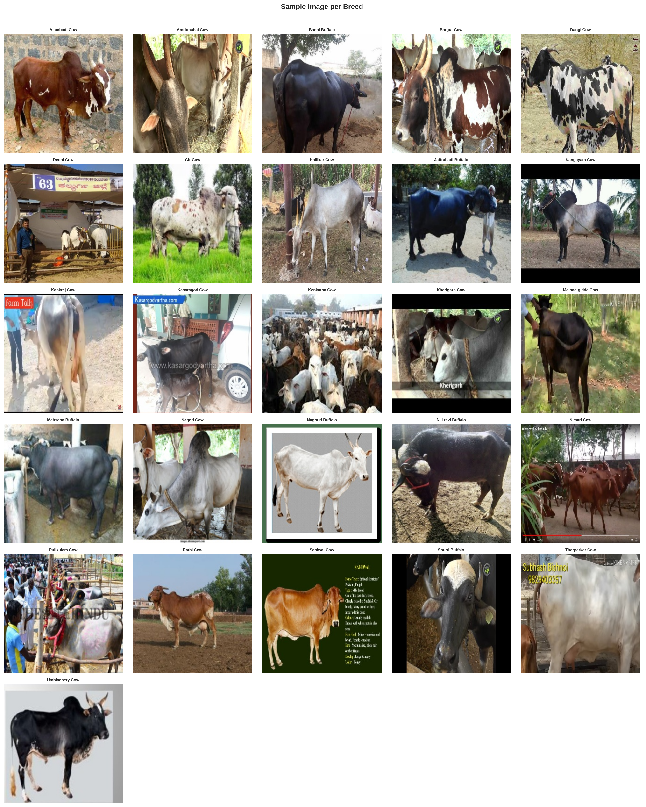
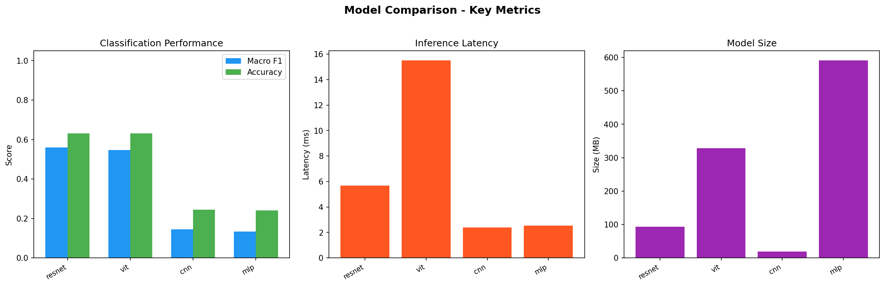
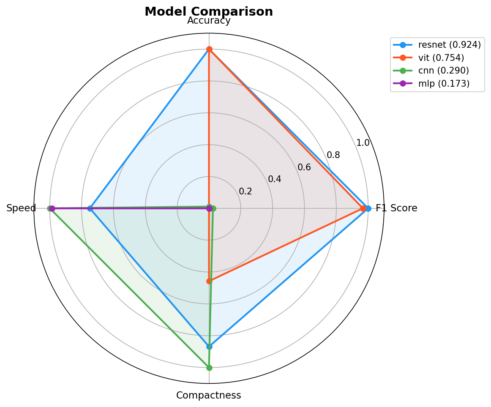

# 🐄 Indigenous Cattle Breed 

A deep learning-based computer vision project for identifying **34 indigenous Indian cattle and buffalo breeds** from images.

The project provides an end-to-end machine learning pipeline covering data preprocessing, augmentation, model training, evaluation, benchmarking, and a web-based application for breed classification.


---

## 📌 Overview

Identifying indigenous Indian cattle and buffalo breeds requires specialized domain knowledge. Farmers, researchers, and agricultural workers may not always have access to breed experts for accurate identification.

This project uses deep learning to classify cattle and buffalo breeds directly from images.

The system supports:

* 🐄 **34 Indigenous Cattle Breeds**
* 🧠 Multiple Deep Learning Architectures
* 📊 Automated Model Evaluation
* ⚡ Inference Benchmarking
* 🌐 FastAPI Backend
* ⚛️ React Frontend
* 🐳 Docker Support

---

# 📊 Dataset and Preprocessing

The dataset contains thousands of images distributed across **34 target classes**.

To prepare the images for deep learning models, the preprocessing pipeline performs:

* Image validation
* Dataset auditing
* Class distribution analysis
* Image resizing
* Image normalization
* Data augmentation
* Training and validation dataset preparation

<p align="center">
  
  
</p>

*Dataset class distribution and sample processed images.*

---

# 🧠 Models Evaluated

The project evaluates four different deep learning architectures.

## 1️⃣ Multilayer Perceptron (MLP)

The MLP model flattens image pixels into a one-dimensional vector and processes them using fully connected neural network layers.

### Advantages

* Simple architecture
* Easy to implement
* Useful as a baseline model

### Limitations

* Does not preserve spatial information
* Large number of parameters
* Poor performance for image classification

### Performance

* Accuracy: **24.0%**
* Macro F1: **13.0%**
* Latency: **2.5 ms**
* Model Size: **590.5 MB**

---

## 2️⃣ Custom CNN

A custom Convolutional Neural Network consisting of five convolutional blocks was trained from scratch.

### Advantages

* Learns spatial features
* Lightweight architecture
* Fast inference
* Small model size

### Limitations

* Requires more training data
* Training from scratch may limit generalization

### Performance

* Accuracy: **24.4%**
* Macro F1: **14.0%**
* Latency: **2.4 ms**
* Model Size: **18.5 MB**

---

## 3️⃣ ResNet-50

A pre-trained ResNet-50 model was fine-tuned using transfer learning.

The model uses knowledge learned from large-scale image datasets and adapts it for cattle and buffalo breed classification.

### Advantages

* Strong feature extraction
* Good balance between speed and accuracy
* Significant improvement over models trained from scratch

### Limitations

* Larger than the custom CNN
* Requires more computational resources

### Performance

* Accuracy: **63.2%**
* Macro F1: **56.0%**
* Latency: **5.7 ms**
* Model Size: **93.7 MB**

---

## 4️⃣ Vision Transformer (ViT-B/16)

The Vision Transformer divides an image into patches and processes them using transformer-based self-attention.

### Advantages

* Captures global image relationships
* Strong contextual feature representation
* High classification accuracy

### Limitations

* Large model size
* Higher inference latency
* More computationally demanding

### Performance

* Accuracy: **63.2%**
* Macro F1: **55.0%**
* Latency: **15.5 ms**
* Model Size: **328.9 MB**

---

# 📈 Model Comparison

| Architecture  |  Accuracy |  Macro F1 | Latency (ms) | Size (MB) |
| ------------- | --------: | --------: | -----------: | --------: |
| **CNN**       |     24.4% |     14.0% |      **2.4** |  **18.5** |
| **MLP**       |     24.0% |     13.0% |          2.5 |     590.5 |
| **ResNet-50** | **63.2%** | **56.0%** |          5.7 |      93.7 |
| **ViT-B/16**  | **63.2%** |     55.0% |         15.5 |     328.9 |

<p align="center">
  
  
</p>

## 🏆 Best Performing Models

Based on the experimental results:

* **ResNet-50** provides the best balance between accuracy, model size, and inference speed.
* **ViT-B/16** achieves similar classification accuracy but requires more memory and has higher inference latency.
* **CNN** is the fastest and smallest model but has significantly lower accuracy.
* **MLP** serves primarily as a baseline model.

---

# 🚀 Running the Project Locally

## Prerequisites

Make sure the following software is installed:

* Python **3.11+**
* Node.js **20+**
* npm
* Git

---

## 1. Clone the Repository

```bash
git clone <https://github.com/HimanshuKumarRout/Cattle-Breed-Detection>
cd Cattle-Breed-Detection
```

---

## 2. Build the Frontend

```bash
cd frontend
npm install
npm run build
cd ..
```

---

## 3. Install Backend Dependencies

```bash
python3 -m pip install -r backend/requirements.txt
```

---

## 4. Configure the Model

Example configuration for the Vision Transformer:

```bash
export MODEL_PATH=models/vit_best.pth
export MODEL_NAME=vit
```

For Windows PowerShell:

```powershell
$env:MODEL_PATH="models/vit_best.pth"
$env:MODEL_NAME="vit"
```

---

## 5. Start the Application

```bash
uvicorn backend.app.main:app --host 0.0.0.0 --port 7860
```

Open the application in your browser:

```text
http://localhost:7860
```

---

# ⚡ Training the Models

The project contains an automated machine learning pipeline for training and evaluating all models.

The workflow includes:

1. Data Audit
2. Data Preprocessing
3. MLP Training
4. CNN Training
5. ResNet-50 Transfer Learning
6. Vision Transformer Training
7. Model Evaluation
8. Performance Benchmarking
9. Model Comparison

Generated training artifacts may include:

* Trained `.pth` model files
* Training logs
* Accuracy metrics
* Macro F1 scores
* Evaluation results
* Benchmark results
* Comparison charts

---

# 🧪 Training with Google Colab

A Google Colab notebook is included for training the models using a GPU.

## Steps

1. Open `colab_run_all.ipynb` in Google Colab.
2. Select a GPU runtime.
3. Run all cells.

The notebook can automate:

* Repository setup
* Dataset preparation
* Data preprocessing
* Model training
* Model evaluation
* Performance benchmarking
* Artifact generation

The training pipeline processes the following stages:

```text
00_data_audit
        ↓
01_mlp
        ↓
02_cnn
        ↓
03_resnet
        ↓
04_vit
        ↓
05_benchmark
```

---

# 🐄 Supported Breeds

The classifier supports **26 indigenous Indian cattle and buffalo breeds**.

## 🐄 Cattle Breeds

1. Alambadi
2. Amritmahal
3. Bargur
4. Dangi
5. Deoni
6. Gir
7. Hallikar
8. Kangayam
9. Kankrej
10. Kasaragod
11. Kenkatha
12. Kherigarh
13. Malnad Gidda
14. Nagori
15. Nimari
16. Pulikulam
17. Rathi
18. Sahiwal
19. Tharparkar
20. Umblachery
21. Vechur
22. Banni
23. Jaffarabadi
24. Mehsana
25. Nagpuri
26. Nili-Ravi
27. Bihjarpuri
28. Ghumusuri
29. Khariar
30. Motu
31. Chilika
32. Kalahandi
33. Manda
34. Punganur

---


# 🛠️ Technology Stack

| Technology   | Usage                      |
| ------------ | -------------------------- |
| Python       | Core development           |
| PyTorch      | Deep learning framework    |
| FastAPI      | Backend API                |
| React        | Frontend interface         |
| Node.js      | Frontend build environment |
| Docker       | Containerization           |
| Google Colab | GPU model training         |

---

# 📂 Project Structure

```text
cattle-breed-classifier/
│
├── backend/
│   ├── app/
│   │   └── main.py
│   └── requirements.txt
│
├── frontend/
│   ├── src/
│   ├── public/
│   └── package.json
│
├── ml/
│   ├── data/
│   ├── models/
│   ├── training/
│   └── artifacts/
│       └── figures/
│
├── models/
│   ├── cnn_best.pth
│   ├── resnet_best.pth
│   └── vit_best.pth
│
├── colab_run_all.ipynb
├── Dockerfile
└── README.md
```

---

# 📊 Evaluation Metrics

The models are evaluated using:

* **Accuracy** — Percentage of correctly classified images.
* **Macro F1 Score** — Average F1-score calculated equally across all classes.
* **Inference Latency** — Time required to classify an image.
* **Model Size** — Storage required for the trained model.

These metrics allow comparison between model accuracy, speed, and deployment requirements.

---

# 🔮 Future Improvements

Potential improvements for the project include:

* Expanding the dataset with more images
* Adding additional indigenous breeds
* Improving class balance
* Using larger pretrained models
* Applying advanced augmentation techniques
* Adding confidence scores for predictions
* Adding top-k breed predictions
* Supporting mobile deployment
* Optimizing models for edge devices
* Adding multilingual support for Indian languages

---

# 📄 License

This project is licensed under the **MIT License**.

---

# 🙌 Acknowledgements

This project was developed to explore the application of **deep learning and computer vision for indigenous livestock breed classification**.

Special focus is placed on comparing traditional neural networks, convolutional architectures, transfer learning, and transformer-based vision models for real-world agricultural image classification.
